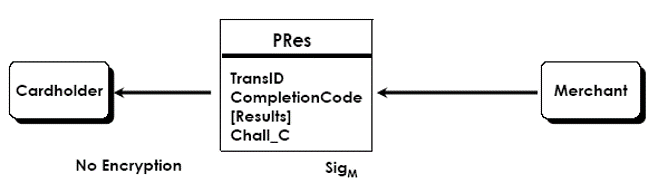

# SET 协议

## 0x01 前言

- 电子支付的流程
  - 如何实现信用卡的安全支付？
  - 安全支付的网络结构？ 
  - 如何在持卡人，商家，银行之间实现信息的按需分配？
- 数字签名、双重数字签名
- Secure Electronic Transaction，SET过程

### Internet上的电子商务安全问题

- 问题: 信用卡，交易数据，信任关系
  - 买家和商家的认证
  - 数据传输的保密性
  - 交易抗抵赖性
  - 消息完整性
  
- 各类系统之间的差异
  - 公钥类型
  - 对称密钥类型
  - 消息摘要算法
  - 拥有私钥方的数目
  - 拥有证书方的数目

### 电子交易的主要模式

电子商务中常见的电子交易有以下五种类型： 
- 支付系统无安全措施的模式
- 通过第三方代理人支付的模式
- 数字现金支付模式
- 简单加密支付系统模式
- 安全电子交易SET支付模式

#### 1 支付系统无安全措施的模型

- 风险由商家承担 
- 商家完全掌握用户的信用卡信息 
- 信用卡信息的传递无安全保障 

#### 2 通过第三方经纪人支付的模型

- 用户账户的开设不通过网络 
- 信用卡信息不在开放的网络上传送 
- 通过电子邮件来确认用户身份 
- 商家自由度大，风险小 
- 支付通过双方都信任的第三方(经纪人TTP？)完成 

#### 3 数字现金支付模型

- 银行和商家之间应有协议和授权关系
- 用户、商家和数字现金的发行都需要使用数字现金软件 
- 适用于小额交易 
- 身份验证是由数字现金本身完成的 
- 数字现金的发行方负责用户和商家之间实际资金的转移 
- 数字现金与普通现金一样，可以存、取和转让

#### 4 简单加密支付系统模式

- 信用卡等关键信息需要加密 
- 使用对称和非对称加密技术 
- 可能要启用身份认证系统 
- 以数字签名确认信息的真实性 
- 需要业务服务器和服务软件的支持 

#### 5 安全电子交易SET支付模式

SET协议的目标
- 信息在互联网上**安全传输，不能被窃听或篡改**
- 用户资料要妥善保护，**商家只能看到订货信息，看不到用户的账户信息**
- **持卡人和商家相互认证**，以确定对方身份
- **软件遵循相同的协议和消息格式**，具有兼容性和互操作性

### 3D 安全支付

- **Acquirer Domain** – The acquirer domain covers the relationship between the merchant and acquirer.
- **Issuer Domai**n – The issuer domain covers the relationship between the cardholder and the issuer.
- **Interoperability Domain** – The relationship between the acquirer and issuer domains is supported by the interoperability domain. 

#### 3D Secure

C: 持卡人
M：商家
I：Issuer，发卡行
A：Acquirer，收单机构（代表商家）
VisaNet：Visa专用支付网络
ACS：持卡人认证服务器
MPI：商家SSL插件

#### 3D-SET

## 0x02 SET 基本过程

### 简介

SET 是使用信用卡交易的官方规范，发布于1996年2月。
Visa 和 MasterCard 研发的专门用于Internet上安全信用卡交易的协议。

- Confidentiality: 消息加密
- Trust: 各方持有数字证书
- Privacy: 信息按需供应

动机：Internet的不安全性
作用范围：SET 仅仅关心支付问题

### 交易主体

#### 主体类型

- 持卡人 Cardholder
- 发卡机构 Issuer
- 商家 Merchant
- 收单银行 Acquirer
- 支付网关 Payment Gateway
- 认证中心 CA

#### 主体证书

- 协议各方持有名字和密钥对
- 身份使用**X.509v3证书**和密钥关联

示例：

#### CA 体系

### 电子支付流程

- 客户在发卡行开户
- 客户持有银行签发的  X.509 V3 证书
- 商家持有两个同类品牌的证书X.509 V3
  - 一个用于签名 &一个用于密钥交换

- 客户向商家发订单初始化请求 （语言，ID，交易卡类型等初始请求）
- 商家发送证书拷贝向客户出示自己身份 （商家证书、网关证书、初始应答、初始应答做摘要后签名）

- 客户发送订单和支付信息给商家
- 商家向支付网关请求支付授权
- 商家确认向客户订单
- 商家向客户提供商品或者服务
- 商家向支付网关请求支付

#### 持卡人

1. 检查：商家证书、网关证书，用商家证书公钥检查初始应答
2. 发送 PReq

#### 商家

1. 首先认证持卡人证书
2. 验证签名摘要的正确性
3. 根据 $H(PI)+OI$，以及持卡人公钥解开的双重数字签名，验证 OI 的准确性
4. 转发 $K_S(\text{持卡人签名的双重数字签名}+PI+H(OI))+KU_b(K_s)$ 到网关
5. 生成支付请求，摘要并签名

#### 网关

1. 用商家证书检查支付请求的完整性，完整则保留
2. $KU_b^{-1}$解数字信封，得到对称密钥 $K_S$ ，用  $K_S$ 解得 $\text{持卡人签名的双重数字签名}+PI+H(OI)$ ，验证双重签名，完整则保留
3. 通过金融专用网，将这些原始信息都发给银行

#### 银行

（重复网关1、2操作，获得PI数据）
比较支付请求与支付信息，开始支付流程

>验证电子证书9次 
>验证数字签名6次
>传递证书7次
>进行签名5次
>对称加密和非对称加密4次

## 0x03 SET 使用的基本技术

### 数字证书

- 由CA签发
- 数据包括
  - 谁拥有该证书
  - 谁签发的该证书
  - 报废日期
  - 用户名和邮件地址
- 数字 ID一般含有下列信息 :
  - 公钥，名字，地址
  - 公钥过期日期, 颁发数字证书的CA名字

### 数字签名

###  双重数字签名

####  概念与作用

概念:  将两个消息连接在一起，这两个消息面向的对象不同。
- Order Information (OI):  客户给商家
- Payment Information (PI):  客户给银行

目标:  **按需分发消息**
- 商家不需要卡信息
- 银行需要订单信息
- 保护客户隐私

**确保信息不被非法使用**。
否则的话，商家有可能将多个支付信息和订单信息交叉组合，牟利。

#### 3.3.1签名过程

将PI和OI分别初次hash.
连接成 [H(PI) || H(OI)] 再hash.
客户私钥加密产生双重签名.
		DS =  EKRC [ H(H(PI) || H(OI)) ]

商家收到 OI 校验签名.
银行收到 PI 校验签名.
客户连接OI和PI，证明该关联.

## 0x04 SET 具体流程

### SET 消息流

### 支付过程初始化

#### InitReq/InitRes

- 明文传输
- Cardholder 浏览选择商品, 下订单，选择银行卡
- 初始化完成 :
  - 获取商家和acquirer的证书
  - 出示银行卡
  - 关联事务id与购买行为

#### InitReq

- 前提:
  - 持卡人需持有商家和支付网关的证书

- 客户向商家发送初始请求信息，获取证书
  - 信用卡的品牌
  - 相应ID
  - 新鲜数

#### InitRes

Merchant replies (InitRes):

- Merchant + Acquirer certificates
- Globally unique transaction ID
 Challenge variable and date proves 
  freshness of variables

### Purchase Order

- 持卡人校验证书并产生OI和PI.
- 下单 : PReq/PRes

#### PReq

下单的请求

简化的PReq示意图

- PReq 交易内容由两部分组成:
  - 订单信息 (OI) : links to order description
  - 支付信息(PI): amount, card data, IDs
- **Dual signature** links the order with them payment

$PReq = K_s(\text{持卡人签名的双重数字签名}+PI+H(OI)) + KU_b(K_s) + H(PI) + OI + \text{持卡人签名的双重数字签名} + \text{持卡人证书}$

#### 商家验证卡用户的身份和授权

- 存储 PI 以转发给acquirer
- 遍历信任链，校验持卡人证书
- 校验双重签名
- 从支付网关那里获取授权
- 发送响应给持卡人，确认订单
- 若授权延迟 PRes 给持卡人“请稍后查询”消息

##### PReq 的验证

#### PRes

下单的回复

简化的PRes示意图

- 完成代码: 交易状态
  - 例如. 授权完成 complete
- 结果: 交易的授权/捕获代码 

### 认证过程

#### AuthReq/AuthRes 

- 校验持卡人的信用
- 含有 PI （来自 PReq）
- 含有 H(OI) ，表明和PI的一致性
- 订单信息明文不发送给 Acquirer
- 商家签名并加密
- 结合授权和捕获＝销售交易 
- 根据AuthRes结果运输商品

#### Acquirer处理

- 解密 AuthReq
- 校验商家签名
- 解密来自于持卡人的 PI
- 校验双重签名
- 从PI中抽取卡数据

作用

- 确保 PI 和 AuthReq 的一致性
- 校验持卡人和商家对于订购行为的一致性: H(Order) ，PI 和 AuthReq
- 通过金融网络获取授权信息
- 生成 AuthRes及其 Capture Token

#### AuthReq

商家发给**支付网关**

#### AuthRes

### 支付完成

- 完成授权 交易的支付
- 通过捕获令牌来完成支付
- 可能多次 AuthResponses的令牌累积后完成
- Capture Token = 金额证据

#### Cap Token

> SET协议交易过程复杂度
>
> 验证电子证书9次
> 验证数字签名6次
> 传递证书7次
> 进行签名5次
> 对称加密和非对称加密4次

## 0x05 结语

### SET 应用场景

### SET 与 SSL 的比较

SET远远不止是一个技术方面的协议，它还说明了每一方所持有的数字证书的含义，希望得到数字证书以及响应信息的各方应有的动作，与一笔交易紧密相关的责任分担。   
SET实现非常复杂，商家和银行都需要改造系统以实现互操作，并且还需要认证中心的支持。   
SET是一个多方的报文协议，它定义了银行、商家、持卡人之间的必须的报文规范。   
SSL只是简单地在两方之间建立一条安全连接。   
SSL是面向连接的，而SET允许各方之间的报文交换不是实时的。 
另外，SET报文能够在银行内部网或者其他网络上传输，而SSL之上的卡支付系统只能与Web浏览器捆绑在一起。   
SSL相对与SET安全性要弱，实际上当初它并不是为支持电子商务而设计的。   
很多银行和电子商务解决方案提供商仍然在使用SSL来构建更多的安全支付系统，但是如果没有经裁剪的客户方软件的话，基于SSL的系统式不能达到像SET这种银行卡专用支付协议所能达到的安全性的。  
