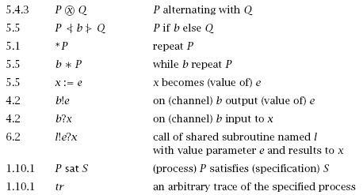

# 基于攻击结构性方法

## 前言

### 问题

- VMS的工作机理？
- 如何以“暴力破解”的形式来分析协议的安全性

### 内容

- CSP基础
- 基于CSP的安全协议建模

### Agents

一个基本的模型

可以把协议看做几个agents的在分布式的网络环境下的交互过程

## CSP概念

- **CSP (Communicating Sequential Processes)** is a notation for describing systems of parallel agents that communicate by passing messages.
- 是用于刻画分布式场景下agents交互的一种模型

## CSP常见符号

- 1.1 进程字母表
- 4.1 在信道c中传输的消息集
- 1.1.1
- 1.1.2 分支结构
- 1.1.3
- 1.1.4 迭代过程
- 1.8
- 2.3 并行执行
- 2.6.2 进程名称
- 2.6.3 2.6.4 进程的命名

- 3.5 差集
- 3.6 interleave 交织 

- 5.1 *P 循环
- 5.5 b*P 条件循环
- 4.2 b!e 信道b上输出变量e的值 
- 4.2 b?x
- 6.2 调用子进程l，e输入到l，l返回值输出到x
- 1.10.1 P sat S 进程P满足规约S
  - 如果不满足出现异常
- 1.10.1 tr 追踪

## CSP形式化定义

- A small mathematical language containing the main constructs for specifying concurrency, parallelism, communication, choice etc.
- The evolution of processes is based on a sequence of events or actions 
  - **Visible actions** $\sum$
    - Interaction with other processes, communication
  - **Invisible action** $\tau$
    - Internal computation steps

## CSP 语法

### Stop

Inaction: $Stop$

终止、死锁、无法执行任何内部或外部操作

### Input

Inaction: $in?x:A\rightarrow P(x)$

在信道in上执行一个输入操作，获取类型为A的x ，然后执行P(x)

### Output

$out!m\rightarrow P(x)$

在信道out上执行一个输出操作，发送消息m，然后执行 P(x)

### Recursion

  $P(y_1,…,y_n) = Body(y_1,…,y_n)$

进程定义. P 为进程名，(y1,…,yn) 是其参数, Body(y1,…,yn) 为进程表达式。

### External choice

External  choice: P [] Q随机性选择一个可执行的进程执行Example:   (a ? x g P(x)) [] (b ? x g Q(x))    仅仅执行一个输入操作。如果没有可执行的进程则中止。

### Internal choice

Internal choice: P + Q随机性选择一个执行，可能选择到无法执行的进程。

### Parallel operator

Example:   $(c ? x \rightarrow P(x)) || (c ! m \rightarrow Q)$ Synchronization: 仅当行为同步呼应时，两个进程才能（向前）执行。Handshaking: 同步性的发送和接受过程，例如键盘缓冲区模型

Communication: 通信，收到传递过来的消息m，执行 P(m)。Broadcasting: c ! m 在信道c上输出m，等待其他进程处理。

### Interleaving

- Parallel operator with synchronization and interleaving: $P ||A Q$ 
  - P 和 Q 仅在共同的动作集A上同步。
  - 在其他非A的动作上，交织。

Prefix

Sample1: A vending machine which consumes one coin breaking  
$(coin) \rightarrow STOP_{\alpha VMS}$

Sample2: At last, a simple vending machine which serves as many chocs as required  
$VMS = (coin → (choc → VMS))$  
$VMS = µ X : {coin, choc} • (coin → (choc → X ))$ 

## Needham- Schroeder公钥协议
### 消息刻画
$$
MSG 
$$
### 信道定义

$\bold{channel} \quad comm,fake,intercept:MSG$

Channel user,session,I_running,R_runing,I_commit,R_commit: Initiator,Responder.

### 进程刻画
$$
INITIATION(a,n_a) \equiv \\
  user.a?b \rightarrow I_runing.a.b \rightarrow \\
  comm

$$

if 挑战应答

### 含有攻击的刻画

信道不一定安全

### 攻击者

Intruder 四个要素
$$
I(m1s,m2s,m3s,ns) \\
comm.Msg1?a.b.Encrypt.k.n.a' \rightarrow \\
if \ k = K_i \ then I(m1s,m2s,m3s,ns \cup \{n\} ) \\
else \ I(m1s \cup \{Encrypt.k.n.a'\} ,m2s,m3s,ns)
$$
ns：Nonce
- 收集消息
- 发送消息

### 系统的进程刻画
$$
AGENT \widehat{=}
$$

## 认证的含义

对于响应者的认证，当且仅当B确实参与到协议的运行中时，A才commit参与和B的session。
对于发起者的认证，当且仅当A确实参与到协议的运行中时，B才commit参与和A的session。
### 规范的刻画（响应者的认证）
$$

$$

## 总结使用CSP进行安全协议建模

- 系统的刻画：消息、信道、agent、攻击者（Intruder）
- 规范的刻画：响应者、发起者
- 运行检查：trace
  - FDR

