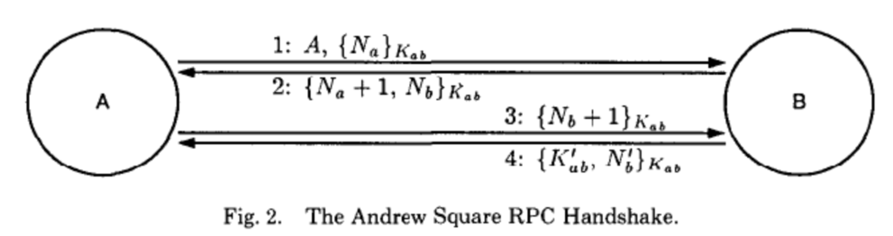

# BAN逻辑

基于推理结构性方法

Paper,
"A Logic of Authentication", ACM Transactions on Computer Systems, Vol. 8, No. 1, pp. 18-36, February 1990.

## 协议安全性的自动化分析

- 选择形式化描述工具进行建模
- 使用某种模型和工具进行分析运算
- 对于所得的结果进行解释

基本术语
## 谓词

- `believes(P,X)`
  - 信念
- `sees(P,X)`
- `said(P,X)`
- `controls(P,X)`
  - 权威性
- `fresh(X)`
- `<X>y` 
- $P \ Q$
- $\{X\}_K$

## message-meaning rule
主要用于消息来源的判断

$$\frac{条件}{结论}$$

$$\frac{P \ \bold{believes} \ Q \xleftrightarrow{K} P,\ P \ \bold{sees} \ \{X\}_K}{P \ \bold{believes} \ Q \ \bold{said} \ X}$$

$$\frac{P \ \bold{believes} \ Q \xleftrightarrow{K},\ P \ \bold{sees} \ \{X\}_{K^{-1}}}{P \ \bold{believes} \ Q \ \bold{said} \ X}$$

$$\frac{P \ \bold{believes} \ Q \xleftrightarrow{K},\ P \ \bold{sees} \ \{X\}_K}{P \ \bold{believes} \ Q \ \bold{said} \ X}$$

## nonce-verifcation rule

$$\frac{P \ \bold{believes} \ \bold{fresh}(X),\ P \ \bold{believes} \ Q \ \bold{said} \ X}{P \ \bold{believes} \ Q \ \bold{believes} \ X}$$

乐观的前提：
1. 相信X是新鲜的。
2. Q是合法的主体，不会撒谎。

## jurisdiction rule 

## 接受规则

$$
\frac{P \ \bold{sees} \ (X,Y)}{}
$$
签名
$$
\frac{P \ \bold{sees} \ \langle X \rangle_Y}{}
$$

解密

## 新鲜性规则

$$
\frac{P \ \bold{believes} \ \bold{fresh}(X)}{P \ \bold{believes} \ \bold{fresh}(X,Y)}
$$
按时间顺序，X是新鲜的，认为与X的结合体(X,Y)是新鲜的，但不能推出fresh(Y)

## BAN逻辑的假定

- 分布式环境的假定：消息可以任意获取
- 分布式特征：会话
- 相信，得到，发送
- 一个基本的语句反映一个公式的若干属性

### 关于协议运作的前期与假定

- Nonces
- 时戳
- 已有密钥
- 密钥创建能力

## 密钥分发与认证的逻辑目标

一个主体对另一个主体对于世界的看法的推断（研判）：密钥是否被对方接受了

双方都有相信的密钥
双方都要对对方对于密钥的认可有研判
$$
\begin{aligned}
&A \ \bold{believes} \ A \xleftrightarrow{K_{ab}} B \\
&A \ \bold{believes} \ B \ \bold{believes} \ A \xleftrightarrow{K_{ab}} B \\
&B \ \bold{believes} \ A \xleftrightarrow{K_{ab}} B \\
&B \ \bold{believes} \ A \ \bold{believes} \ A \xleftrightarrow{K_{ab}} B \\
\end{aligned}
$$

## Kerberos 协议分析
$$
Message1. \\ 
Message2. \\
Message3. \\
Message4. \\
$$
### 理想化，idealization

初始化、预处理

- 忽略掉消息中的明文部分

### 推理三
$$
A \ \bold{believes} \ A \xleftrightarrow{K_{ab}} B \\
B \ \bold{believes} \ A \xleftrightarrow{K_{ab}} B \\
B \ \bold{believes} \ B \ \bold{believes} \ A \xleftrightarrow{K_{ab}} B \\
A \ \bold{believes} \ B \ \bold{believes} \ A \xleftrightarrow{K_{ab}} B \\
$$

## Andrew安全RPC握手协议分析

## RPC协议

$$
\begin{aligned}
&Message1. A \rightarrow B: A,\{N_a\}_{K_{ab}} \\ 
&Message2. B \rightarrow A: \{N_a+1,N_b\}_{K_{ab}} \\
&Message3. A \rightarrow B: \{N_b+1\}_{K_{ab}} \\
&Message4. B \rightarrow A: \{K'_{ab},N'_b\}_{K_{ab}} \\
\end{aligned}
$$

### 理想化

$$
\begin{aligned}
&Message1. A \rightarrow B: A,\{N_a\}_{K_{ab}} \\ 
&Message2. B \rightarrow A: \{N_a+1,N_b\}_{K_{ab}} \\
&Message3. A \rightarrow B: \{N_b+1\}_{K_{ab}} \\
&Message4. B \rightarrow A: \{ A \xleftrightarrow{K_{ab}} B,N'_b\}_{K_{ab}} \\
\end{aligned}
$$

### 初始假定

新鲜数只对发送方有研判价值

### 结论

$$
\begin{aligned}
&B \ \bold{believes} \ A \xleftrightarrow{K'_{ab}} B \\
&A \ \bold{believes} \ B \ \bold{said} \ (A \xleftrightarrow{K'_{ab}} B,N'_b) \\
&B \ \bold{believes} \ B \ \bold{believes} \ A \xleftrightarrow{K_{ab}} B \\
&A \ \bold{believes} \ B \ \bold{believes} \ A \xleftrightarrow{K_{ab}} B \\
\end{aligned}
$$

## 总结

### BAN逻辑分析的过程

- 理想化协议
- 初始状态及其假设
- 协议目标
- 逻辑推理

### BAN逻辑的缺陷

- 非标准的理想化协议过程：明文忽略问题
- 不合理的假设：主体诚实性问题
- 违规现象：重放攻击

