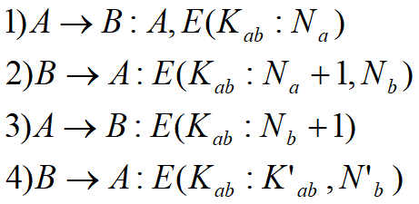
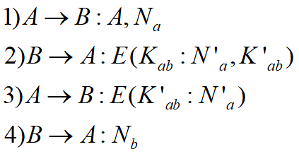
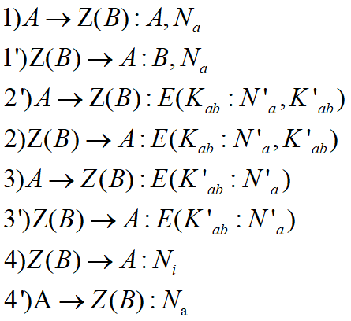
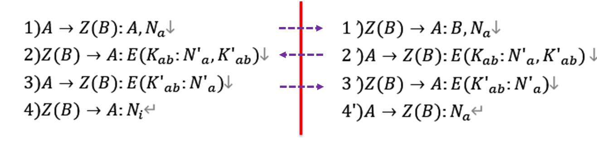
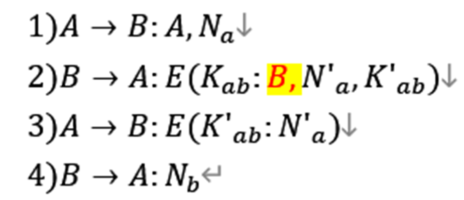
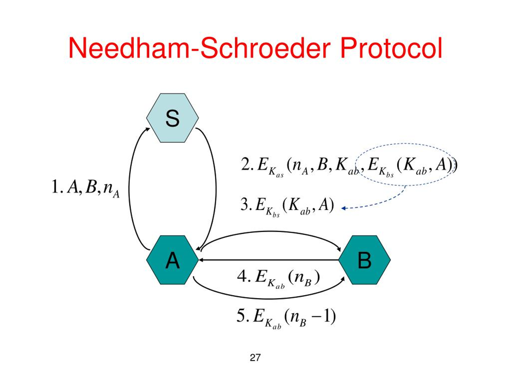
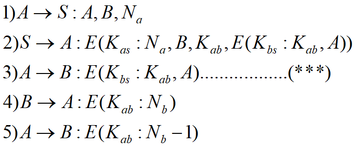

## 协议

## 安全协议

安全协议类型

- 密钥交换协议
- 认证协议
- 认证和秘钥交换协议
- 电子商务：公平性、SET协议

## 安全协议的系统模型

- 合法参与者：发起者、接收者
- 攻击者：被动攻击者、主动攻击者
- 环境

协议的多轮次和并发性

分布式协议的攻击场景

协议的安全属性

- 认证性：
- 秘密性：加密
- 完整性：Hash函数、ICV
- 不可否认性：对目标消息的签名绑定

## 安全协议的缺陷

- 协议设计要素
  - 主体身份标识
  - 签名
  - 随机数
  - 时戳
- 缺陷分类
  - 基本协议缺陷
  - 陈旧消息
  - 并行会话

### 消息重放

定义：攻击者把协议系统中曾经出现过的消息重新利用发给协议参与者（轮内或者不同轮次之间），来实现攻击目的的一种手段。

- 对策：
  - 序列号
  - 时戳
  - 挑战－应答

## 良好密钥的标准

- 新鲜产生，或者来自于可信第三方
- 仅仅被参与协议的指定合法主体所拥有

## 安全协议

- 无可信第三方参与的对称密钥协议
- 有可信第三方参与的对称密钥协议
- 无可信第三方参与的公钥协议
- 有可信第三方参与的公钥协议
- 其它协议

## 无可信第三方参与的对称密钥协议

### RPC协议

协议目的：利用已有的共享密钥建立新的会话密钥

简化版本

多重会话攻击

不同轮次的攻击视角

**攻击手段：拦截，假冒，（轮间）重放攻击**

- 密钥虽未泄露，但是：
- A试图与B协商新的会话密钥，未遂，但A以为和B完成了密钥协商。
- B并未参与协议的执行。

加固措施

身份标识

## 有可信第三方参与的对称密钥协议

### Needham Schroeder协议

A对B没有明确的挑战

类型缺陷：

攻击者构造一个 $N_z$ ，与 $E(K_{ab}:N_b)$ 类型相似
