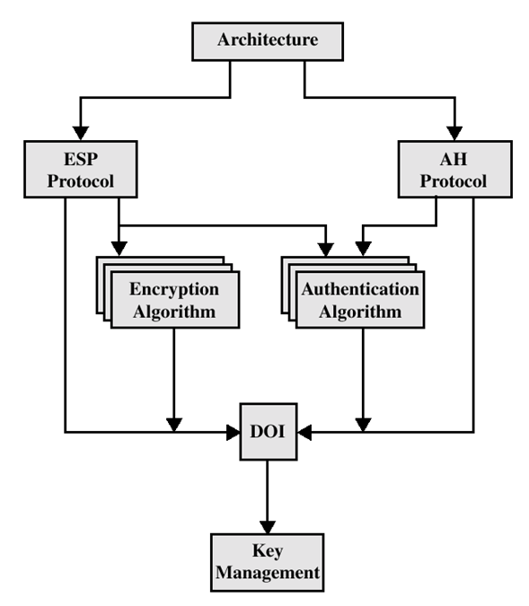
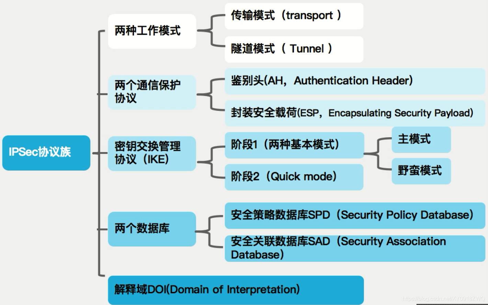
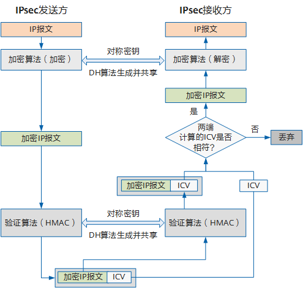
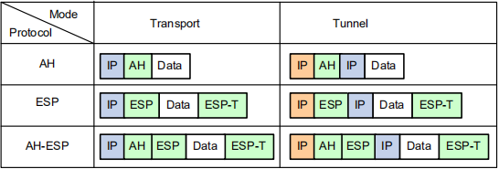
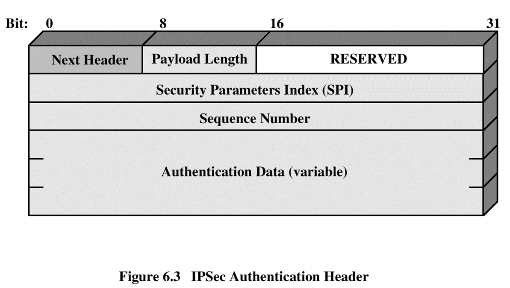
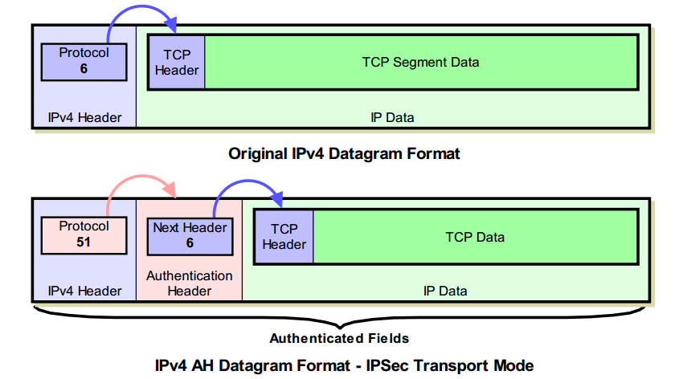
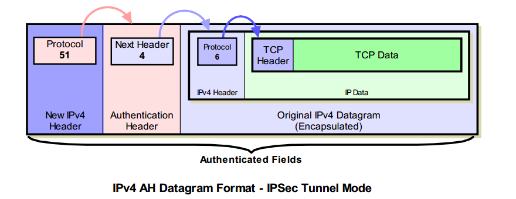
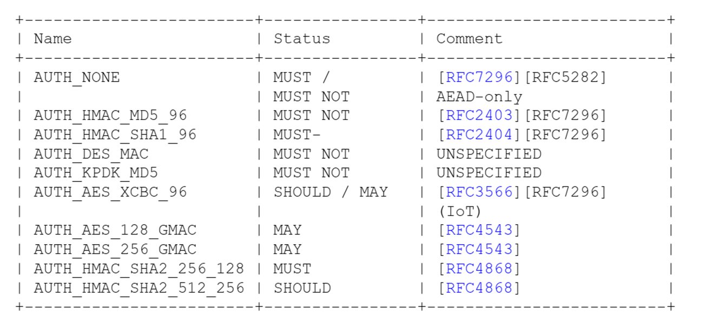
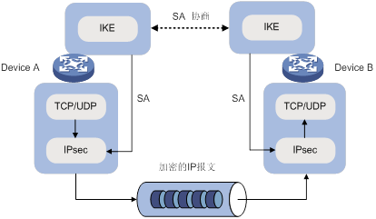

# IPsec协议

## 前言

### IP安全问题

- 源地址欺骗
- 包重放
- 无身份认证
- 无数据完整性和机密性
- 

## 概述

IPSec（互联网协议安全）是一个安全网络协议套件，用于保护互联网或公共网络传输的数据。IETF在 1990 年代中期开发了 IPSec 协议，它通过 IP网络数据包的身份验证和加密来提供 IP 层的安全性。

- IPsec对IPv4是可选的，对IPv6是必须的。
- 

## IPsec体系

## 0x01 IPsec概念

- IPSec（互联网协议安全）是一个安全网络协议套件，用于保护互联网或公共网络传输的数据。IETF在 1990 年代中期开发了 IPSec 协议，它通过 IP网络数据包的身份验证和加密来提供 IP 层的安全性。

- 目的：是把安全机制引入IP协议，使用现代密码学方法支持机密性和认证性服务，确保公网上数据通信的可靠性和完整性。 
- 随着IPv6的制定而产生的，IPSec对IPV4是可选的，对IPV6是必须的，IPSec由三种机制共同保障：**认证、信息机密性、密钥管理**。确保通信的可靠性、完整性。

数据源认证 (IP address) 完整性保护 重放攻击保护 机密性和隐私 SJTU School of Cyber Science and EngineeringDOS预防 (Clogging, DOS) Support for IPv4, IPv6 (mandatory in IPv6)

### 1.2  SA (Security Associations) 安全联盟

安全联盟（SA）是 IPsec 的一个基本概念，它构成了 IPsec 的基础。见 RFC 1825。
SA 是两个 IPSec 实体之间，经过协商建立起来的一种协定（内容包括各种 IPSec 用到的参数算发等）

- SAs 由**安全参数索引 Security Parameter Index（SPI）**和 **目标地址** 组成
- SA 是单向的，每个通信双方都要有两种 SA，**三元组唯一标识**（SPI，目的 IP 地址，IPSec 协议）
  - SA 的参数 认证算法和模式
    - 加密算法和模式
    - 相关密钥
    - 密钥生命周期
    - SA 生命周期
    - SA 源地址
    - 敏感水平（秘密还是未分类）
  - SPI 用于标识具有相同 IP 地址和相同安全协议的不同的 SA
    - 
  - 目的 IP 地址
    - SA 的终端地址
  - IPsec协议参数
    - AH
    - ESP
    - AH-ESP

### 1.3 SAD（Security Association Data）安全关联数据库

SAD包含了所有活跃的 SA 的所有参数信息，存储 SA 的数据库。

- **对于外出的流量**，如果需要使用 IPSec 处理，然而相应的 SA 不存在，则 IPSec 将启动IKE来协商出一个 SA，并存储到 SAD 中。
- **对于进入的流量**，如果需要进行 IPSec 处理，IPSec 将从 IP 包中得到三元组（SPI,DST,Protocol），并利用这个三元组在 SAD 中查找一个 SA

- 由手工创建 或 经由IKE创建

### 1.4 SPD（Security Policy Data）安全策略库

#### SP

Security Policy，安全策略，决定对 IP 数据包是否提供保护，提供何种保护，以何种方式保护（指向 SA）
主要根据源IP地址、目的IP地址、入数据还是出数据等来标识

#### SPD

Security Policy Data，安全策略数据库，将所有的 SP 以某种数据结构集中存储的列表。SPD用于为IPsec 实现提供安全策略配置。

- 含有用户定义的策略.：每个报文的安全服务及其水平。
- 含有规则列表: <TrafficSelector, action>
- TrafficSelector
  - IP addresses and/or ports (specific or range),
  - protocol (TCP/UDP/?);
- Action：当接收或将要发出IP包时，首先要查找SPD来决定如何进行处理
  - **Discard，丢弃**：流量不能离开主机或者发送到应用程序，也不能进行转发
  - **Bypass IPsec，不用 IPSec**：对流量作为普通流量处理，不需要额外的 IPSec 保护
  - **Apply IPsec，使用 IPSec**：对流量应用 IPSec 保护，此时这条安全策略要指向一个 SA。对于**外出流量**，如果该 SA 尚不存在，则启动 IKE 进行协商，把协商的结果连接到该安全策略上；

### 1.6 AH（Authentication Header）认证头

AH 协议：Authentication Header，认证头协议，协议号：51。见RFC 1826。
工作原理是在每一个数据包上添加一个身份验证报头。此报头包含一个带密钥的hash散列，此hash散列在整个数据包中计算，因此对数据的任何更改将致使散列无效--这样就提供了完整性保护，这样可以确认数据有否被篡改及防止第三方攻击；

- 完整性：有，包括IP header （哈希校验） 
- 认证：有 （共享秘钥）
- 防重放：有 （ESP 头中序列号字段）
- **数据加密：无，数据无机密性保护**

AH协议为IP通信提供数据源认证、数据完整性和反重播保证，它能保护通信免受篡改，但不能防止窃听，适合用于传输非机密数据。

AH的工作原理是在每一个数据包上添加一个身份验证报头。

#### 1.6.1 AH传输模式（点到点）

- AH被插在IP头之后但在所有的传输层协议(如TCP、UDP)之前，或其它IPSec协议头之前
- 源IP地址、目的IP地址是不能修改的，否则会被检测出来。 
- 传输模式下，**NAT与AH冲突，完整性校验失败**

#### 1.6.2 AH隧道模式

IP隧道技术又称为IP封装技术，它可以将带有源和目标IP地址的数据报文使用新的源和目标IP进行第二次封装，这样这个报文就可以发送到一个指定的目标主机上。

边际路由器之间的传输。

- 隧道模式：AH插在原始的IP头之前，另外生成一个新的IP头放在AH之前；
- **加密整个IP数据报**，包括全部TCP/IP或UDP/IP头和数据，并用自己的地址作为源地址加入到新的IP头。
- AH验证的范围也是**整个IP包**，**因此AH和NAT的冲突在隧道模式下也存在**

#### 1.6.3 AH加密算法

#### 1.6.4 AH输入输出处理流程

- 输出处理过程：(senders end)
  - SA安全关联查找 Security Association Lookup
  - 序列号生成 Sequence Number Generation
  - ICV计算 ICV computation
  - 填充 Padding
  - 分片 Fragmentation
- 接受处理过程：(receivers end)
  - 重组 Reassembly
  - 安全关联查找 Security Association Lookup
  - 序列号验证 Sequence Number Verification
  - ICV 验证 ICV verification

### 1.7 ESP（Encapsulating Security Payload）封装安全载荷

ESP 是插入IP数据包内的一个协议头，可以为IP提供机密性、数据源认证、抗重播以及数据完整性等安 全服务 ESP将需要保护的数据进行加密后，在封装在IP包中，主要支持IP数据项的机密性。 ESP也提供认证服务。

## 0x02 IKE（Internet Key Exchange）因特网密钥交换协议

### 2.1 IPsec与IKE的关系

- IKE是**UDP**之上的一个**应用层协议**，是IPsec的信令协议
- IKE为IPsec**协商建立安全联盟**，并把建立的**参数**及生成的**密钥**交给IPsec 。
- IPsec使用IKE建立的安全联盟对IP报文**加密**或**验证**处理
- IPsec处理做为IP层的一部分，在IP层对报文进行处理。AH协议和ESP协议有自己的协议号，分别是 51 和 50。

### 2.2 IKE的安全机制

- 完善的前向安全性（PFS：Perfect Forward Security） 
  - 是密码学中通讯协议*的*安全属性，指的是长期使用的主密钥泄漏不会导致过去的会话密钥泄漏。
- 数据验证
  - 保证数据**完整性**（发送的数据未被第三方修改过） 
  - **身份保护**
- DH交换和密钥分发
  - Diffie-Hellman算法是一种公共密钥算法。通信双方在不传送密钥的情况下通过交换一些数据，计算出共享的密钥。
  - PFS特性是由DH算法保障的

### 2.3 IKE协商过程

IKE协商分为两个阶段

- 阶段一：在网络上建立IKE SA，为其它协议的协商（阶段二）提供保护和快速协商。通过协商创建 一个通信信道，并对该信道进行认证，为双方进一步的IKE通信提供机密性、消息完整性以及消息源认证服务； 

  - 在通信双方之间架设一个安全，认证的信道。
  - 对通信双方进行认证和保护
  - 协商待用的SA策略
  - 实施共享密钥的交换
  - 为阶段2架设安全通道
  - 两工作模式: Main mode or Aggressive mode

- 阶段二：快速模式，在IKE SA的保护下完成IPSec的协商。用在第一阶段建立的安全隧道为IPsec协商安全服务，即为IPsec协商具体的SA，建立用于最终的IP数据安全传输的IPsec SA。

  - n协商IPSec SA 参数

    n为特定的协议构建IPSec (like FTP, telnet, etc)

    n周期性协商 IPSec SA

    n选择性执行DH

### 2.4 阶段一两种模式：主模式与野蛮模式

IKE协商过程中包含三对消息： 

- 第一对叫**SA交换**，是协商确认有关安全策略的过程； 
- 第二对消息叫**密钥交换**，交换Diffie-Hellman公共值和辅助数据（如：随机数），加密物在这个阶 段产生； 
- 最后一对消息是**ID信息和验证数据交换**，进行身份验证和对整个SA交换进行验证。

第一阶段协商的信息如下：

1、对等体之间采用何种方式做认证，是预共享密钥还是数字证书。

2、双方使用哪种加密算法（DES、3DES）

3、双方使用哪种HMAC方式，是MD5还是SHA

4、双方使用哪种Diffie-Hellman密钥组

5、使用哪种协商模式（主模式或主动模式）

6、协商SA的生存期

第二阶段协商信息如下：

1、双方使用哪种封装技术，AH还是ESP

2、双方使用哪种加密算法

3、双方使用哪种HMAC方式，是MD5还是SHA

4、使用哪种传输模式，是隧道模式还是传输模式

5、协商SA的生存期

